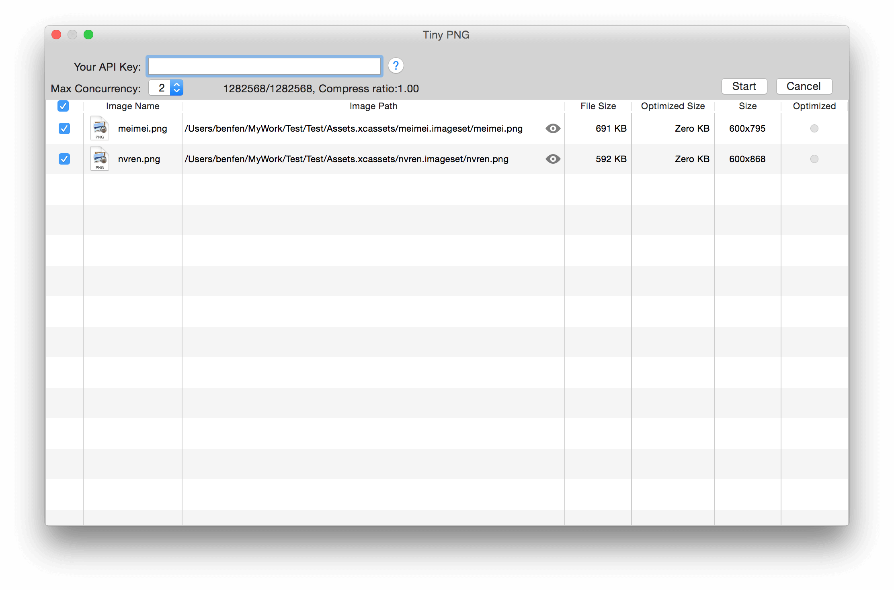
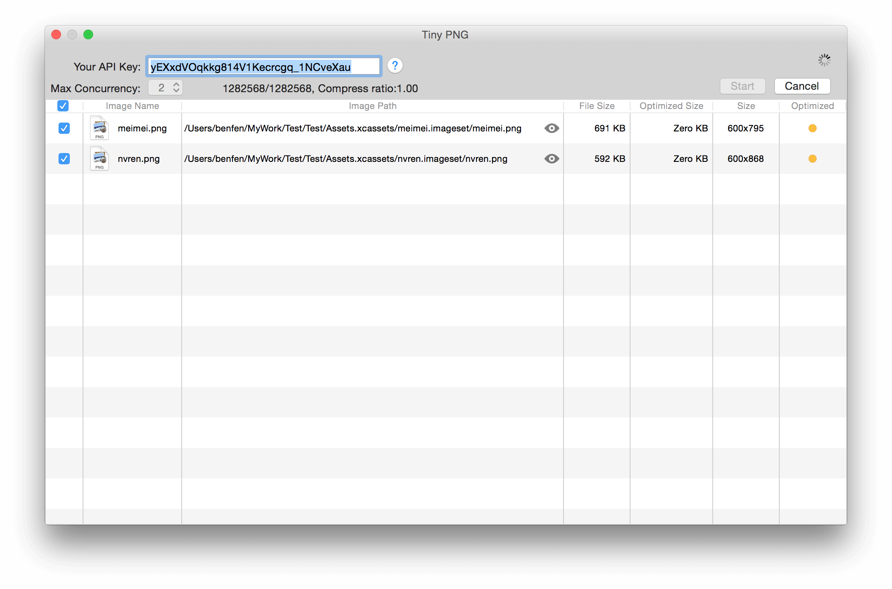
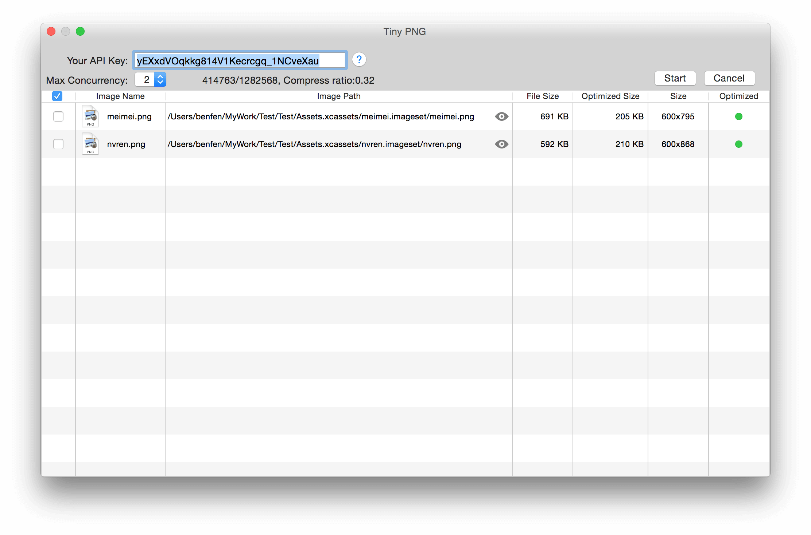
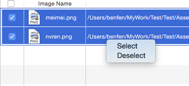
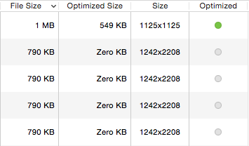
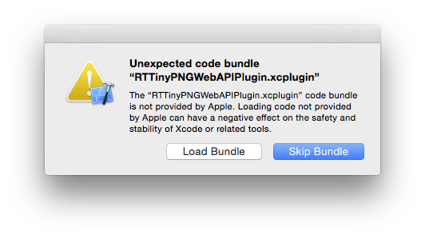

# RTTinyPNGWebAPIPlugin [](https://travis-ci.org/rickytan/RTTinyPNGWebAPIPlugin) [](./LICENSE)

[](http://rickytan.cn/donate/ "Donate me a cup of coffee")

## Introduction

This is a simple **Xcode Plugin** to help **iOS** developers to minimize app assets, it calls <https://tinypng.com> api to compress your `.png`, `.jpg` image resources. So before you using this, please get your api key [HERE](https://tinypng.com/developers).

## Usage

### State

A image source has 4 states, whith are:

- *Normal*, <span style="display: inline-block; width: 12px; height: 12px; border-radius: 6px; background: gray"></span> not optimized



- *Pending*, <span style="display: inline-block; width: 12px; height: 12px; border-radius: 6px; background: orange"></span>waiting for optimization



- *Optimized*, <span style="display: inline-block; width: 12px; height: 12px; border-radius: 6px; background: green"></span>



- *Error*, <span style="display: inline-block; width: 12px; height: 12px; border-radius: 6px; background: red"></span> a network error occurred

### Selection

When **Start** button pressed, the selected(with a check mark on the left) images are pushed into a processing queue, waiting for compressing. Your can click the checkbox on the table header to toggle select/deselect all, or click and drag to multi-select, then use the context menu to select/deselect multiple items.



### Sorting

The **Image Name**, **Image Path**, **File Size**, **Optimized** columns support sorting, use them well :smile:.



## How to install

* Just clone or download the Repo, and build with your **Xcode**, then restart **Xcode**.
* Download the binary [HERE](https://github.com/rickytan/RTTinyPNGWebAPIPlugin/releases), decompress and move it to `~/Library/Application Support/Developer/Shared/Xcode/Plug-ins`
* ~~Open [Package Manager](http://alcatraz.io/) and search `RTTinyPNGWebAPIPlugin`~~ (Not yet)

> **Note**: If Xcode prompt a dialog, please click **Load Bundle**.
> 
> 

After you successfully installed the plugin, you can open the plugin window in **File** menu, or press `Shift Control t` for short.

## Issues

If you find any bug(s), please let me know: <https://github.com/rickytan/RTTinyPNGWebAPIPlugin/issues>

## License

**MIT**

``` 
The MIT License (MIT)

Copyright (c) 2016 Ricky Tan

Permission is hereby granted, free of charge, to any person obtaining a copy
of this software and associated documentation files (the "Software"), to deal
in the Software without restriction, including without limitation the rights
to use, copy, modify, merge, publish, distribute, sublicense, and/or sell
copies of the Software, and to permit persons to whom the Software is
furnished to do so, subject to the following conditions:

The above copyright notice and this permission notice shall be included in all
copies or substantial portions of the Software.

THE SOFTWARE IS PROVIDED "AS IS", WITHOUT WARRANTY OF ANY KIND, EXPRESS OR
IMPLIED, INCLUDING BUT NOT LIMITED TO THE WARRANTIES OF MERCHANTABILITY,
FITNESS FOR A PARTICULAR PURPOSE AND NONINFRINGEMENT. IN NO EVENT SHALL THE
AUTHORS OR COPYRIGHT HOLDERS BE LIABLE FOR ANY CLAIM, DAMAGES OR OTHER
LIABILITY, WHETHER IN AN ACTION OF CONTRACT, TORT OR OTHERWISE, ARISING FROM,
OUT OF OR IN CONNECTION WITH THE SOFTWARE OR THE USE OR OTHER DEALINGS IN THE
SOFTWARE.
```
